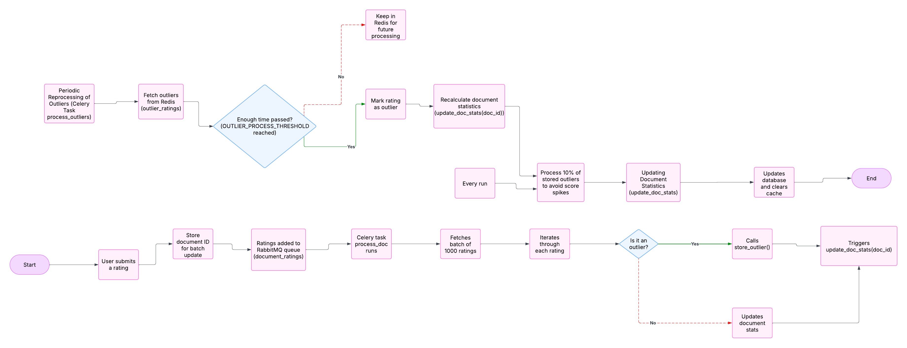

# Flow of Applying Ratings, Outlier Detection, and Reprocessing

This system manages user-submitted ratings for documents, detects outliers, and reprocesses them after a certain period. It utilizes **Celery tasks**, **Redis caching**, and **RabbitMQ** for asynchronous task execution and efficient processing.

## Rating Submission and Initial Processing

### Receiving a Rating
- When a user submits a rating for a document, it is stored in the `Rating` model.
- The system checks whether the rating is an outlier using `document.detect_outlier(rating.score)`, which is based on standard deviation calculations.

### Outlier Detection Logic
- A rating is considered an outlier if it significantly deviates from the document’s historical rating distribution (beyond a defined threshold such as 2 standard deviations).
- Two possible cases:
  
  #### Not an Outlier
  - The document updates its cached statistics to reflect the new rating.
  - The document ID is stored for batch updating of statistics.
  
  #### Outlier Detected
  - The rating is temporarily stored in **Redis** as a potential outlier using `store_outlier(doc_id, rating_id)`.
  - This prevents immediate deletion or rejection, allowing for re-evaluation later.
  - A log entry is created to indicate an outlier has been found.

## Batch Processing of Ratings Using RabbitMQ

### RabbitMQ Message Queue (`process_doc` Task)
- Ratings are temporarily stored in a **RabbitMQ queue (`document_ratings`)** for batch processing.
- The `process_doc` Celery task:
  1. Connects to RabbitMQ.
  2. Fetches up to `BATCH_SIZE` messages.
  3. Iterates through each rating to determine if it’s an outlier.
  4. Calls `store_outlier()` if necessary.
  5. Otherwise, updates the document’s cached rating statistics.
  6. Triggers `update_doc_stats(doc_id)` asynchronously for recalculating statistics.

## Periodic Reprocessing of Outliers

### `process_outliers` Task
- Runs periodically based on Celery’s schedule.
- Retrieves outliers stored in Redis (`outlier_ratings` key).
- Processes them only if a threshold time (`OUTLIER_PROCESS_THRESHOLD`) has passed.

#### Outlier Processing Logic
- If **enough time** has passed (`time.time() - outlier["timestamp"] >= OUTLIER_PROCESS_THRESHOLD`):
  - The associated document’s statistics are recalculated via `update_doc_stats(doc_id)`.
- Otherwise, the rating remains in Redis for future re-evaluation.
- Also every time the job schedules it read 10% of the outliered data and process them to avoid peaks in avearge score and make it more normalied. 

## Updating Document Statistics (`update_doc_stats`)
- Triggered whenever ratings are processed or reprocessed.
- Retrieves the document and recalculates:
  - **Average Score** (`calculate_average_score()`)
  - **Standard Deviation** (`calculate_standard_deviation()`)
  - **Total Ratings Count** (`number_of_ratings()`)
- Updates the document’s database entry and clears cached data.

## Summary of Flow
1. **User submits a rating.**
2. **RabbitMQ stores the rating for batch processing.**
3. The **`process_doc`** task runs:
   - Determines if the rating is an **outlier**.
   - If **not an outlier**, updates document statistics.
   - If **outlier detected**, stores it in **Redis** for re-evaluation.
4. After a delay (`OUTLIER_PROCESS_THRESHOLD`), the **`process_outliers`** task runs:
   - If enough time has passed, marks the rating as an outlier in the database.
   - Otherwise, keeps it in Redis for future processing.
5. **Document statistics are periodically updated** via `update_doc_stats`.

